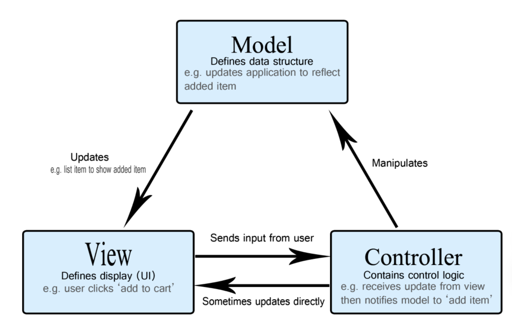
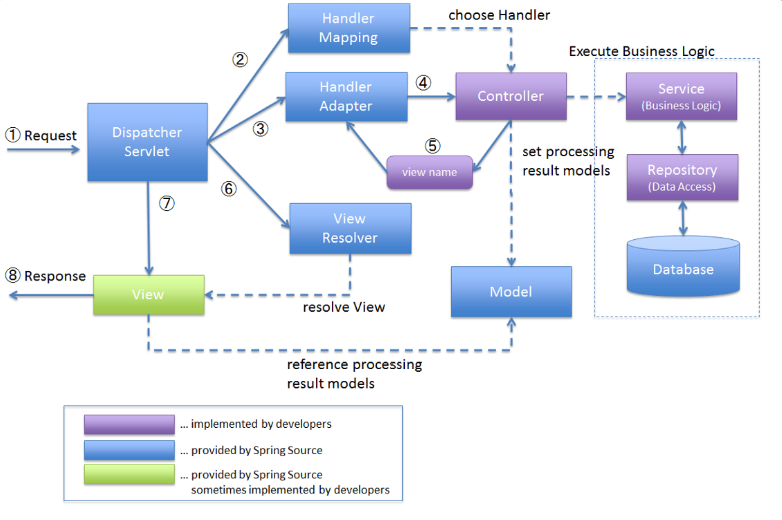

## MVC 패턴?

{: width="550" height="300" }

기본적인 소프트웨어 디자인 패턴인 MVC패턴은 사용자 인터페이스, 데이터 및 논리 제어를 구현하는데 널리 사용되는 소프트웨어 디자인 패턴입니다.

이 MVC 패턴은 3가지 구성 요소로 나뉘어 각각의 역할을 명확하게 정의하고 있습니다.

### 모델 (M)

모델은 데이터와 관련된 모든 작업을 처리하며, 비즈니스 로직을 구현하는 곳입니다. 예를 들면, 클라이언트가 로그인 버튼을 누르면 컨트롤러를 통해 모델에 정보가 전달됩니다. 모델은 데이터베이스와 상호작용하여 아이디와 패스워드가 유효한지, 일치하는지를 확인합니다.

즉, 모델은 데이터베이스와 상호작용을 하고 필요한 비즈니스 로직을 처리하여 결과를 생성한 후, 이를 컨트롤러에 전달합니다.

### 뷰 (V)

뷰는 사용자의 입력을 받아 컨트롤러에 전달하고, 컨트롤러로부터 받은 결과를 사용자에게 보여줍니다. 간단히 말해, 사용자가 눈으로 보는 모든 것, 즉 사용자 인터페이스입니다.

### 컨트롤러 (C)

컨트롤러는 뷰로부터 데이터를 받아 모델에 전달하고, 모델의 처리 결과에 따라 뷰를 업데이트합니다. 한마디로, 컨트롤러는 중간에서 데이터를 전달하고 결과값을 반환하는 역할을 하는 다리와 같습니다.

## Spring MVC?

{: width="550" height="300" }

Spring MVC는 MVC 모델을 기반으로 만들어졌습니다. Spring MVC는 Spring에서 지공하는 웹 모듈로 M ( Model ), V ( View ), C ( Controller ) 이렇게 3가지 구성 요소를 사용해 사용자의 다양한 HTTP 요청( `Request`)을 처리하고 그에 대해 응답(`Response`)할 수 있도록 만든 프레임 워크입니다.

먼저 동작 방식을 살펴보겠습니다.

## 동작방식

1. Spring MVC의 모든 HTTP 요청은 먼저 Dispathce Servlet이 수신합니다.
2. 요청을 수신하고 나면, Handler Mapping을 사용하여 요청 URL과 매핑된 핸들러 (Controller)를 찾습니다.
3. 핸들러를 찾게 되면 Dispacher Servlet은 해당 핸들러를 실행할 수 있는 Handler Adapter를 찾습니다.
4. Handler Adapter가 핸들러를 실행하면, 핸들러(Controller)는 비즈니스 로직을 수행하고 결과를 반환합니다. 해당 결과는 보통 ModleAndView로 표현됩니다.
5. Controller에서는 메서드를 실행하고나서 마지막으로 View name을 반환합니다.
6. 핸들러가 반환한 View name을 기반으로 Dispatcher Servlet은 ViewReslover을 사용해 실제 랜더링할 View를 찾습니다.
7. 선택된 뷰를 렌더링하고 최종적으로 HTML, JSON, XML 등의 형태로 응답을 생성합니다.

위의 과정은 JSP나 서블릿을 기준으로 한 동작과정 입니다. 현재의 대부분 웹들은 프론트와 백엔드로 나뉘어 서로 통신하기 때문에 Spring에서는 5번까지만 하고 나머지 6~7번, View부분은 프론트엔드 프레임워크나, 라이브러리가 담당하고 있습니다.

### `Dispatcher Servlet`

Spring MVC에서 가장 핵심적일 역할을 하고 있는 프론트 컨트롤러입니다. 모든 HTTP 요청, 즉 클라이언트 요청은 먼저 `Dispatcher Servlet` 으로 들어오며, 요청을 처리하고 Spring MVC의 다양한 컴포넌트들과 상호작용합니다.

### `Handler Mapping`

`Dispatcher Servlet` 은 Spring MVC에서 출입구 역할을 하고 있는 `Front Controller`입니다. 들어온 요청을 먼저 `Handler Mapping` 에게 전달합니다. `Handler Mapping` 은 요청을 받아 요청 URL과 이를 처리할 핸들러(메서드, 클래스)를 연결하는 중요한 컴포넌트 입니다. 예를 들어서 `/testURL`, `method = Post` 형식으로 들어오면 `/testURL`을 처리하고, `method`는 `Post`인 메서드로 요청을 매핑합니다.

### `Handler Adapter`

`Handler Adapter` 은 `Handler Maaping` 에서 매핑한 메서드를 실행할 수 있도록 도와주는 컴포넌트 입니다.

`Handler Adapter`의 주요 역할은 다음과 같습니다

1. 핸들러 실행
  - `Handler Mapping`이 반환한 핸들러를 호출합니다.
2. 핸들러 호환성
  - 핸들러의 유형이 상관없이 요청을 처리할 수 있게 해줍니다.
  - 예를 들어서 `@RequestMapping`이 붙은 매서드, `HttpRequestHandler`, `SimpleController`인터페이스를 구현한 클래스 등 다양한 형태의 핸들러가 존재하는데 Handler Adapter은 이를 모두 일관되게 처리할 수 있게 해줍니다.

### `Controller`

`Controller`는 주로 클라이언트의 요청을 직접적으로 처리하는 역할을 담당합니다. 주로 `@Controller`나 `@RestController` 어노테이션 사용에 의해 정의됩니다.

`Handler Adapter`의 반환된 값에 의해 `Controller`의 메서드를 호출하면 해당 메서드 안에 정의된 비즈니스 로직이 실행됩니다. 이 로직은 주로 `Service` 계층을 호출하여 비즈니스 로직을 처리하고, 반환값을 받아서 클라이언트에게 전달합니다.

`Service`

`Servie`는 비스니스 로직을 담고 있는 클래스입니다.  주로 `@Service` 어노테이션에 의해 정의되어 있으며, 해당 클래스는 핵심 비즈니스 로직이 담겨 있습니다.

`Repository`

DB와의 상호작용을 담당하는 계층입니다. `@Repository` 어노테이션에 의해 정의되어 있으며 DB에 대한 쿼리 실행, 트랜잭션 관리, 데이터 매핑 등의 기능을 제공하고 있습니다.

### `View name`

`View name` 은 컨트롤에서 매서드에 있는 비즈니스 로직을 실행하고 나서 반환 되는 문자열로, 어떤 뷰를 사용해서 응답을 생성할지 결정하는 부분입니다. 주올 JSP, Thymeleaf, Freemarker같은 템플릿 엔진을 사용하는 경우 해당합니다.

```jsx
@Controller
public class HomeController {

    @GetMapping("/home")
    public String home() {
        return "home";  // <- View name
    }
}

```

### `View Resovler`

`View name` 을 기반으로 적절한 템플릿 파일을 찾아 이를 `View` 객체로 변환하는 역할을 합니다.

### `View`

`View Resovler`에 의해 만들어진 뷰 객체를 이용해 클라이언트에게 렌더링 되는 최종 결과를 생성하는 역할입니다.
